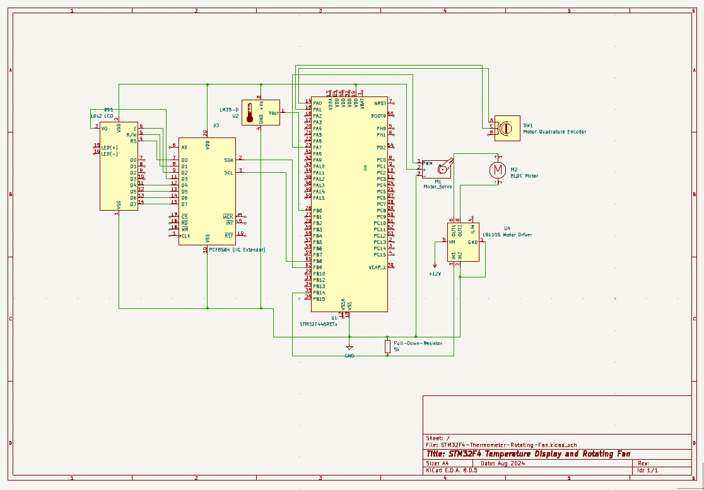

# STM32F4 MCU Thermometer and Rotating Fan Controller

**[Demo Video](https://youtu.be/MhBhJYdzf1E)**

This project takes the temperature (ADC), displays the reading to an LCD (I2C + implemented driver), and turns on a rotating fan built with a servo (PWM) and BLDC Motor at different speeds according to the read temperature. This project was built on an STM32F4MCU board using STM's HAL and drivers that I wrote for peripherals.

# Project Details

## Temperature
The temperature is taken from a TMP102 analog output sensor. The analog value is interpretted by the microcontroller's ADC peripheral. The ADC polls for a reading every 5 seconds. This procedure is non-blocking, it uses a timer interrupt to control the periodicity of the reading.

## Display
The temperature is displayed on a 16x2 LCD in degrees Fahrenheit every 5 seconds. The LCD has an I2C GPIO Extender Module attached which allows for the microcontroller to send the data via its I2C Peripheral. I wrote the driver for the LCD and you can find the source code in file `lcd-driver.c`.

## Rotating Fan
The rotating fan is made up of a Servo, a Brushless DC Motor, an Incremental Encoder, and an L9110 Motor Driver. The fan turns on if the temperature reading is above a particular level.  
The fan has 3 levels corresponding to different speeds of rotation. The level of the fan is determined by the microcontroller according to how high the temperature reading was.  
The fan will stay on for a minimum of 1 minute; this procedure is non-blocking so that the rest of the program functions can still operate.

### Servo
The Servo receives a PWM signal from the microcontroller in order to rotate. The PWM signal is updated in a timer interrupt every 0.25s causing the angle of rotation to vary 120 degrees.

### BLDC Motor, Encoder, and Motor Driver
The DC Motor provides feedback to the microcontroller through its Incremental Encoder. The microcontroller has a Timer configured for Encoder Mode which interprets this data.  
The speed of the Motor is controlled via a PID controller. The PID controller first receives the feedback from the Encoder and interprest the current speed of rotation of the motor. It compares it to some reference value (provided by the level of the fan) and computes the error using a PID algorithm. 
A PWM Signal is then generated to correct the error and is fed to the Motor Driver which regulates the voltage supplied to the Motor.
